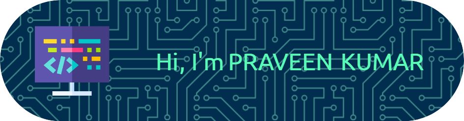

# 👋 Hi

---

## 🌟 About Me

I am an aspiring computer scientist passionate about Artificial Intelligence, Machine Learning, and Software Development. I am currently pursuing my Bachelor of Technology at IIIT Sri City. My mission is to leverage technology to solve real-world problems and contribute to cutting-edge innovation.

- 🎓 **Education**: B.Tech in Electronics and Communication Engineering (2021–2025)
- 💡 **Interests**: AI/ML, Full-Stack Development, IoT Security
- 📜 **Certifications**:
  - IoT and Autonomous Systems (British Council, IEEE ITSS)
  - Full Stack Development (Maximilian Schwarzmuller)

---

## 💻 Skills

### Programming Languages

### Development Tools

### Soft Skills
- Problem Solving
- Teamwork
- Communication
- Leadership

---

## 💼 Experience

### Web Development Intern @ Exposys Data Labs  
**(June 2024 – August 2024)**
- Built a responsive MERN Stack application, improving cross-device usability.
- Optimized website performance by minimizing load times.
- Collaborated with an agile team to deliver dynamic, real-time features.

---

## 🔥 Projects

### Road Quality Index Prediction

- **Technologies**: React Native, TensorFlow, HERE API
- Achieved 95% accuracy in RTQI predictions and developed a mobile app for route suggestions.

### Social Media Platform (MERN Stack)

- Developed a secure, scalable platform with JWT authentication.
- Optimized MongoDB queries and ensured cross-browser compatibility.

---

## 📚 Publications

- **Efficient RAM Cell Design Using Quantum Dot Cellular Automata**
  - *Presented at IEEE Conference 2024*
  - Enhanced RAM design with optimized voltage performance and fewer cells.

---

## 🏆 Achievements

- 🥈 **Runner-Up** in Smart Mobility Hackathon: Skid and pothole detection technologies using IMU sensors.
- 🏏 **Spectra Sports League (Cricket)**: Led the team to victory, showcasing strategic and leadership skills.

---

## 📫 Connect With Me

- 🌐 **Portfolio**: [praveen-kumar.vercel.app](https://praveen-kumar.vercel.app/)
- 📧 **Email**: [praveenkumarg079@gmail.com](mailto:praveenkumarg079@gmail.com)
